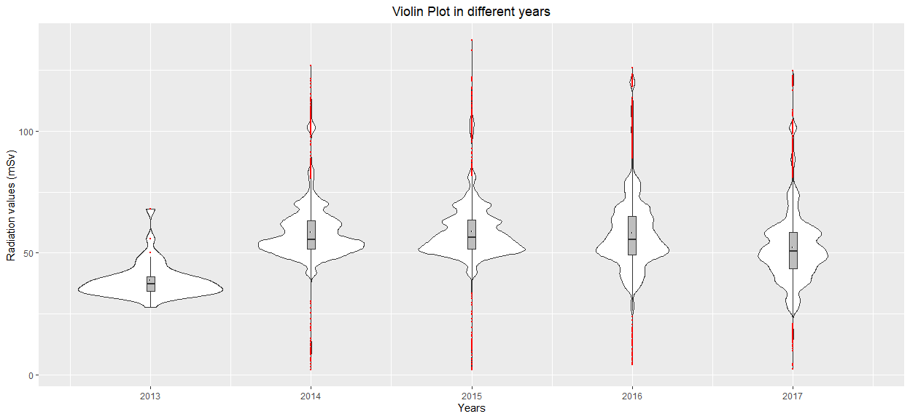
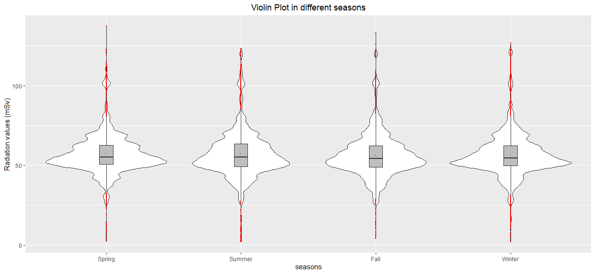
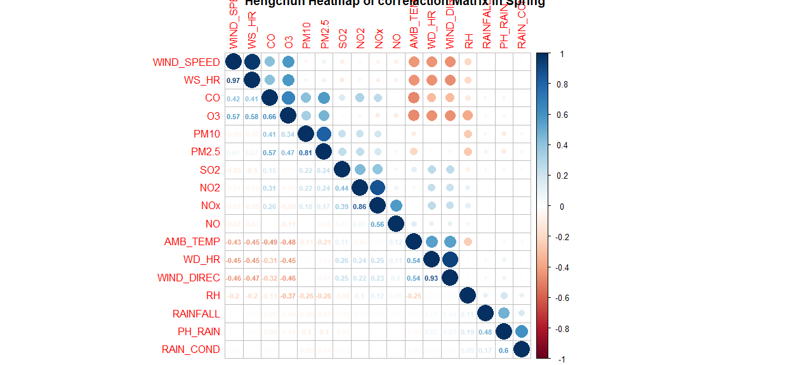
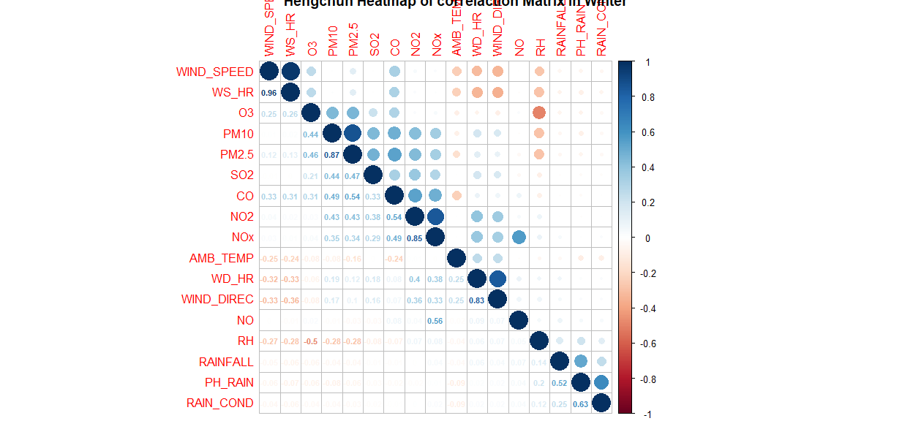

#### 摘要

環境輻射監測數據除了作為評估公共衛生的標準外，也可讓民眾了解所在區域有多少量、多少種放射物質存在，並測試用於人類可接受輻射劑量的數學模型，以此預防更大不受監控的釋放或放射性的擴散釋放，並評估對生物群可能造成的影響。為了盡可能準確地掌握環境輻射監測數據的波動變化，故本計劃擷取二零一四年至二零一七年共四年環境輻射監測歷史數據進行敘述統計分析、趨勢變化分析等分析方法，找出不同的環境輻射監測站所監測到的環境輻射監測數據與不同的設立位置或監測時間的相關性，藉此研究其可能較高離群輻射值，並更進一步結合空氣品質監測公開資料，與環境輻射監測數據是否有相關性。


#### 資料說明

本計劃使用行政院原子能委員會輻射偵測中心所提供之環境輻射監測歷史數據公開資料的時間週期為二零一四年至二零一七年，共四年資料。環境輻射監測的核設施包含核一廠、核二廠、核三廠、龍門核能電廠、核能研究所、清華大學及蘭嶼貯存場等七個設施。資料為每小時一筆資料，其單位為微西弗(µSv)。為了後續利於計算，故將全部輻射監測值統一乘於一千，換算成毫西弗(mSv)。

本計劃的目的是找出不同的環境輻射監測站所監測到的環境輻射監測數據與不同的設立位置或監測時間的相關性，藉此研究其可能較高離群輻射值，故以原始資料中所提供的時間週期以及測站地點兩大方向進行探討。


```r
summary(DF_l)
```

```
##    rad_site              date                       rad_value     
##  Length:1612944     Min.   :2013-12-31 08:00:00   Min.   : 24.00  
##  Class :character   1st Qu.:2014-12-31 13:45:00   1st Qu.: 50.00  
##  Mode  :character   Median :2015-12-31 19:30:00   Median : 55.00  
##                     Mean   :2015-12-31 19:30:00   Mean   : 57.05  
##                     3rd Qu.:2016-12-31 01:15:00   3rd Qu.: 63.00  
##                     Max.   :2017-12-31 07:00:00   Max.   :216.00  
##                                                   NA's   :30135   
##       alt         insideOrNot       
##  Min.   :  10.0   Length:1612944    
##  1st Qu.:  17.0   Class :character  
##  Median :  25.5   Mode  :character  
##  Mean   : 137.3                     
##  3rd Qu.:  73.0                     
##  Max.   :2413.0                     
## 
```

- 環境輻射監測值資料表欄位說明：
    - rad_site：環境輻射監測站，為了與空氣品質監測站做區分，故在環境輻射值資料表中以「rad_site」做表示。
    - date : 日期，時間週期為二零一四至二零一八共四年資料，是以每小時為一筆紀錄。
    - rad_value：輻射值，單位為毫西弗(mSv)；如同輻射監測站，為了與空氣品質監測值做區分，故在輻射值資料表中以「rad_value」做表示。
    - alt：海拔，因各環境輻射測站所設置的位置不同，環境輻射監測可能也會受此影響，故將此環境因素也納入資料表中。
    - airstation：空氣品質監測站，為了與空氣品質監測資料表做結合，以資料表中的空氣品質監測站做對應欄位，作為後續與空氣品質監測資料表合併時的主要欄位。
    - insideOrNot：是否在二十公里範圍內，因環境輻射監測值資料表是將七個設施週遭監測站全部包含在內，為了後續要進行地區劃分方便才加入此欄位。


#### 由環境輻射監測時間週期為出發點進行探討

根據不同的時間週期，繪製出能體現環境輻射監測值的資料分佈的小提琴圖，並且加以深入分析。


```
## Warning in grid.Call(C_stringMetric, as.graphicsAnnot(x$label)): font
## family not found in Windows font database

## Warning in grid.Call(C_stringMetric, as.graphicsAnnot(x$label)): font
## family not found in Windows font database

## Warning in grid.Call(C_stringMetric, as.graphicsAnnot(x$label)): font
## family not found in Windows font database
```

```
## Warning in grid.Call(C_textBounds, as.graphicsAnnot(x$label), x$x, x$y, :
## font family not found in Windows font database

## Warning in grid.Call(C_textBounds, as.graphicsAnnot(x$label), x$x, x$y, :
## font family not found in Windows font database

## Warning in grid.Call(C_textBounds, as.graphicsAnnot(x$label), x$x, x$y, :
## font family not found in Windows font database

## Warning in grid.Call(C_textBounds, as.graphicsAnnot(x$label), x$x, x$y, :
## font family not found in Windows font database

## Warning in grid.Call(C_textBounds, as.graphicsAnnot(x$label), x$x, x$y, :
## font family not found in Windows font database

## Warning in grid.Call(C_textBounds, as.graphicsAnnot(x$label), x$x, x$y, :
## font family not found in Windows font database

## Warning in grid.Call(C_textBounds, as.graphicsAnnot(x$label), x$x, x$y, :
## font family not found in Windows font database

## Warning in grid.Call(C_textBounds, as.graphicsAnnot(x$label), x$x, x$y, :
## font family not found in Windows font database
```

```
## Warning in grid.Call.graphics(C_text, as.graphicsAnnot(x$label), x$x,
## x$y, : font family not found in Windows font database
```

```
## Warning in grid.Call(C_textBounds, as.graphicsAnnot(x$label), x$x, x$y, :
## font family not found in Windows font database
```

<!-- -->


```
## Warning in grid.Call(C_textBounds, as.graphicsAnnot(x$label), x$x, x$y, :
## font family not found in Windows font database

## Warning in grid.Call(C_textBounds, as.graphicsAnnot(x$label), x$x, x$y, :
## font family not found in Windows font database

## Warning in grid.Call(C_textBounds, as.graphicsAnnot(x$label), x$x, x$y, :
## font family not found in Windows font database

## Warning in grid.Call(C_textBounds, as.graphicsAnnot(x$label), x$x, x$y, :
## font family not found in Windows font database

## Warning in grid.Call(C_textBounds, as.graphicsAnnot(x$label), x$x, x$y, :
## font family not found in Windows font database

## Warning in grid.Call(C_textBounds, as.graphicsAnnot(x$label), x$x, x$y, :
## font family not found in Windows font database

## Warning in grid.Call(C_textBounds, as.graphicsAnnot(x$label), x$x, x$y, :
## font family not found in Windows font database

## Warning in grid.Call(C_textBounds, as.graphicsAnnot(x$label), x$x, x$y, :
## font family not found in Windows font database

## Warning in grid.Call(C_textBounds, as.graphicsAnnot(x$label), x$x, x$y, :
## font family not found in Windows font database

## Warning in grid.Call(C_textBounds, as.graphicsAnnot(x$label), x$x, x$y, :
## font family not found in Windows font database
```

```
## Warning in grid.Call.graphics(C_text, as.graphicsAnnot(x$label), x$x,
## x$y, : font family not found in Windows font database
```

```
## Warning in grid.Call(C_textBounds, as.graphicsAnnot(x$label), x$x, x$y, :
## font family not found in Windows font database
```

<!-- -->


```
## Warning in grid.Call(C_textBounds, as.graphicsAnnot(x$label), x$x, x$y, :
## font family not found in Windows font database

## Warning in grid.Call(C_textBounds, as.graphicsAnnot(x$label), x$x, x$y, :
## font family not found in Windows font database

## Warning in grid.Call(C_textBounds, as.graphicsAnnot(x$label), x$x, x$y, :
## font family not found in Windows font database

## Warning in grid.Call(C_textBounds, as.graphicsAnnot(x$label), x$x, x$y, :
## font family not found in Windows font database

## Warning in grid.Call(C_textBounds, as.graphicsAnnot(x$label), x$x, x$y, :
## font family not found in Windows font database

## Warning in grid.Call(C_textBounds, as.graphicsAnnot(x$label), x$x, x$y, :
## font family not found in Windows font database

## Warning in grid.Call(C_textBounds, as.graphicsAnnot(x$label), x$x, x$y, :
## font family not found in Windows font database

## Warning in grid.Call(C_textBounds, as.graphicsAnnot(x$label), x$x, x$y, :
## font family not found in Windows font database

## Warning in grid.Call(C_textBounds, as.graphicsAnnot(x$label), x$x, x$y, :
## font family not found in Windows font database

## Warning in grid.Call(C_textBounds, as.graphicsAnnot(x$label), x$x, x$y, :
## font family not found in Windows font database
```

```
## Warning in grid.Call.graphics(C_text, as.graphicsAnnot(x$label), x$x,
## x$y, : font family not found in Windows font database
```

```
## Warning in grid.Call(C_textBounds, as.graphicsAnnot(x$label), x$x, x$y, :
## font family not found in Windows font database
```

<!-- -->

- 圖一為「2014 ~ 2017年全台不分年不分站整體環境輻射監測小提琴圖」，首先可從此圖看出監測到的數據大約分佈在50毫西弗左右，而整體數值的平均值及中位數皆落在此範圍之內並且十分接近；由此可見，在四年中整體的環境輻射監測值分布較為均勻，也沒有受到極端值所影響。另外此圖引人注目的特點是高劑量率尾部，理論上來說應是平滑的尾部，卻在100毫西弗左右再次高了起來，為了更近一步探討其原因，在圖二及圖三中將小提琴圖拆成四年時間及四個季節進行深入分析。

- 圖二「2014 ~ 2017年分年不分站環境輻射監測小提琴圖」中首先可見：以紅色點標註的離群值角度來看，2015年所監測到的離群值相較其他三年來偏高，使得該離群值較高之原因可再搭配季節，或該時間點的空氣品質監測數據或是氣象局資料進行深入探討。而除了離群值外，在這四年的監測數據的分佈型態看來，四年的資料分佈均較為集中，四年的中位數及平均值均較相近，但四年的資料分佈如同整體一樣，在尾部區段應是平滑的表現，卻又再次的高聳起來，而此處高聳之原因，將會在後面擷取離群值的部分加以說明。

- 最後在圖三「2014 ~ 2017年全台分季不分站環境輻射監測小提琴圖」中可見：根據四季監測到的數據平均值及中位數可看出其數據分佈均較為集中，承圖二於2015年之較高離群值，於春季時有一離群值相較其他點高出很多，而該離群值所在的時間點是於2015年的春季，更進一步的查詢可發現為2015年05月25日的阿里山測站所測得的數據，其原因可再搭配當日所發生的事件結合加以探討。

- 以這三張圖來看，季節的變化對於環境輻射監測值的分佈並無明顯影響；以年作為觀測時間長度時，則有不同的分佈型態呈現。由此可見，日後可針對年週期作為取樣的時間週期標準。

#### 由環境輻射監測站設立位置為出發點進行探討

以環境輻射監測站設立地點為出發點，搭配台灣地圖將各測站所在的地區及其監測到的數據使用不同顏色標記，若該地區設立複數個測站，則將該地區所有測站監測到的日劑量率加總除以該地區總測站數。根據此出發點，與小提琴圖類同進行以年和季為群組進行繪圖。


```
## Warning in grid.Call(C_textBounds, as.graphicsAnnot(x$label), x$x, x$y, :
## font family not found in Windows font database

## Warning in grid.Call(C_textBounds, as.graphicsAnnot(x$label), x$x, x$y, :
## font family not found in Windows font database

## Warning in grid.Call(C_textBounds, as.graphicsAnnot(x$label), x$x, x$y, :
## font family not found in Windows font database

## Warning in grid.Call(C_textBounds, as.graphicsAnnot(x$label), x$x, x$y, :
## font family not found in Windows font database

## Warning in grid.Call(C_textBounds, as.graphicsAnnot(x$label), x$x, x$y, :
## font family not found in Windows font database

## Warning in grid.Call(C_textBounds, as.graphicsAnnot(x$label), x$x, x$y, :
## font family not found in Windows font database

## Warning in grid.Call(C_textBounds, as.graphicsAnnot(x$label), x$x, x$y, :
## font family not found in Windows font database

## Warning in grid.Call(C_textBounds, as.graphicsAnnot(x$label), x$x, x$y, :
## font family not found in Windows font database

## Warning in grid.Call(C_textBounds, as.graphicsAnnot(x$label), x$x, x$y, :
## font family not found in Windows font database

## Warning in grid.Call(C_textBounds, as.graphicsAnnot(x$label), x$x, x$y, :
## font family not found in Windows font database

## Warning in grid.Call(C_textBounds, as.graphicsAnnot(x$label), x$x, x$y, :
## font family not found in Windows font database

## Warning in grid.Call(C_textBounds, as.graphicsAnnot(x$label), x$x, x$y, :
## font family not found in Windows font database
```

```
## Warning in grid.Call.graphics(C_text, as.graphicsAnnot(x$label), x$x,
## x$y, : font family not found in Windows font database
```

```
## Warning in grid.Call(C_textBounds, as.graphicsAnnot(x$label), x$x, x$y, :
## font family not found in Windows font database

## Warning in grid.Call(C_textBounds, as.graphicsAnnot(x$label), x$x, x$y, :
## font family not found in Windows font database

## Warning in grid.Call(C_textBounds, as.graphicsAnnot(x$label), x$x, x$y, :
## font family not found in Windows font database
```

<!-- -->


```
## Warning in grid.Call(C_textBounds, as.graphicsAnnot(x$label), x$x, x$y, :
## font family not found in Windows font database

## Warning in grid.Call(C_textBounds, as.graphicsAnnot(x$label), x$x, x$y, :
## font family not found in Windows font database

## Warning in grid.Call(C_textBounds, as.graphicsAnnot(x$label), x$x, x$y, :
## font family not found in Windows font database

## Warning in grid.Call(C_textBounds, as.graphicsAnnot(x$label), x$x, x$y, :
## font family not found in Windows font database

## Warning in grid.Call(C_textBounds, as.graphicsAnnot(x$label), x$x, x$y, :
## font family not found in Windows font database

## Warning in grid.Call(C_textBounds, as.graphicsAnnot(x$label), x$x, x$y, :
## font family not found in Windows font database

## Warning in grid.Call(C_textBounds, as.graphicsAnnot(x$label), x$x, x$y, :
## font family not found in Windows font database

## Warning in grid.Call(C_textBounds, as.graphicsAnnot(x$label), x$x, x$y, :
## font family not found in Windows font database

## Warning in grid.Call(C_textBounds, as.graphicsAnnot(x$label), x$x, x$y, :
## font family not found in Windows font database

## Warning in grid.Call(C_textBounds, as.graphicsAnnot(x$label), x$x, x$y, :
## font family not found in Windows font database

## Warning in grid.Call(C_textBounds, as.graphicsAnnot(x$label), x$x, x$y, :
## font family not found in Windows font database

## Warning in grid.Call(C_textBounds, as.graphicsAnnot(x$label), x$x, x$y, :
## font family not found in Windows font database
```

```
## Warning in grid.Call.graphics(C_text, as.graphicsAnnot(x$label), x$x,
## x$y, : font family not found in Windows font database
```

```
## Warning in grid.Call(C_textBounds, as.graphicsAnnot(x$label), x$x, x$y, :
## font family not found in Windows font database

## Warning in grid.Call(C_textBounds, as.graphicsAnnot(x$label), x$x, x$y, :
## font family not found in Windows font database

## Warning in grid.Call(C_textBounds, as.graphicsAnnot(x$label), x$x, x$y, :
## font family not found in Windows font database
```

<!-- -->


```
## Warning in grid.Call(C_textBounds, as.graphicsAnnot(x$label), x$x, x$y, :
## font family not found in Windows font database

## Warning in grid.Call(C_textBounds, as.graphicsAnnot(x$label), x$x, x$y, :
## font family not found in Windows font database

## Warning in grid.Call(C_textBounds, as.graphicsAnnot(x$label), x$x, x$y, :
## font family not found in Windows font database

## Warning in grid.Call(C_textBounds, as.graphicsAnnot(x$label), x$x, x$y, :
## font family not found in Windows font database

## Warning in grid.Call(C_textBounds, as.graphicsAnnot(x$label), x$x, x$y, :
## font family not found in Windows font database

## Warning in grid.Call(C_textBounds, as.graphicsAnnot(x$label), x$x, x$y, :
## font family not found in Windows font database

## Warning in grid.Call(C_textBounds, as.graphicsAnnot(x$label), x$x, x$y, :
## font family not found in Windows font database

## Warning in grid.Call(C_textBounds, as.graphicsAnnot(x$label), x$x, x$y, :
## font family not found in Windows font database

## Warning in grid.Call(C_textBounds, as.graphicsAnnot(x$label), x$x, x$y, :
## font family not found in Windows font database

## Warning in grid.Call(C_textBounds, as.graphicsAnnot(x$label), x$x, x$y, :
## font family not found in Windows font database

## Warning in grid.Call(C_textBounds, as.graphicsAnnot(x$label), x$x, x$y, :
## font family not found in Windows font database

## Warning in grid.Call(C_textBounds, as.graphicsAnnot(x$label), x$x, x$y, :
## font family not found in Windows font database
```

```
## Warning in grid.Call.graphics(C_text, as.graphicsAnnot(x$label), x$x,
## x$y, : font family not found in Windows font database
```

```
## Warning in grid.Call(C_textBounds, as.graphicsAnnot(x$label), x$x, x$y, :
## font family not found in Windows font database

## Warning in grid.Call(C_textBounds, as.graphicsAnnot(x$label), x$x, x$y, :
## font family not found in Windows font database

## Warning in grid.Call(C_textBounds, as.graphicsAnnot(x$label), x$x, x$y, :
## font family not found in Windows font database
```

<!-- -->


```
## Warning in grid.Call(C_textBounds, as.graphicsAnnot(x$label), x$x, x$y, :
## font family not found in Windows font database

## Warning in grid.Call(C_textBounds, as.graphicsAnnot(x$label), x$x, x$y, :
## font family not found in Windows font database

## Warning in grid.Call(C_textBounds, as.graphicsAnnot(x$label), x$x, x$y, :
## font family not found in Windows font database

## Warning in grid.Call(C_textBounds, as.graphicsAnnot(x$label), x$x, x$y, :
## font family not found in Windows font database

## Warning in grid.Call(C_textBounds, as.graphicsAnnot(x$label), x$x, x$y, :
## font family not found in Windows font database

## Warning in grid.Call(C_textBounds, as.graphicsAnnot(x$label), x$x, x$y, :
## font family not found in Windows font database

## Warning in grid.Call(C_textBounds, as.graphicsAnnot(x$label), x$x, x$y, :
## font family not found in Windows font database

## Warning in grid.Call(C_textBounds, as.graphicsAnnot(x$label), x$x, x$y, :
## font family not found in Windows font database

## Warning in grid.Call(C_textBounds, as.graphicsAnnot(x$label), x$x, x$y, :
## font family not found in Windows font database

## Warning in grid.Call(C_textBounds, as.graphicsAnnot(x$label), x$x, x$y, :
## font family not found in Windows font database

## Warning in grid.Call(C_textBounds, as.graphicsAnnot(x$label), x$x, x$y, :
## font family not found in Windows font database

## Warning in grid.Call(C_textBounds, as.graphicsAnnot(x$label), x$x, x$y, :
## font family not found in Windows font database
```

```
## Warning in grid.Call.graphics(C_text, as.graphicsAnnot(x$label), x$x,
## x$y, : font family not found in Windows font database
```

```
## Warning in grid.Call(C_textBounds, as.graphicsAnnot(x$label), x$x, x$y, :
## font family not found in Windows font database

## Warning in grid.Call(C_textBounds, as.graphicsAnnot(x$label), x$x, x$y, :
## font family not found in Windows font database

## Warning in grid.Call(C_textBounds, as.graphicsAnnot(x$label), x$x, x$y, :
## font family not found in Windows font database
```

<!-- -->


```
## Warning in grid.Call(C_textBounds, as.graphicsAnnot(x$label), x$x, x$y, :
## font family not found in Windows font database

## Warning in grid.Call(C_textBounds, as.graphicsAnnot(x$label), x$x, x$y, :
## font family not found in Windows font database

## Warning in grid.Call(C_textBounds, as.graphicsAnnot(x$label), x$x, x$y, :
## font family not found in Windows font database

## Warning in grid.Call(C_textBounds, as.graphicsAnnot(x$label), x$x, x$y, :
## font family not found in Windows font database

## Warning in grid.Call(C_textBounds, as.graphicsAnnot(x$label), x$x, x$y, :
## font family not found in Windows font database

## Warning in grid.Call(C_textBounds, as.graphicsAnnot(x$label), x$x, x$y, :
## font family not found in Windows font database

## Warning in grid.Call(C_textBounds, as.graphicsAnnot(x$label), x$x, x$y, :
## font family not found in Windows font database

## Warning in grid.Call(C_textBounds, as.graphicsAnnot(x$label), x$x, x$y, :
## font family not found in Windows font database

## Warning in grid.Call(C_textBounds, as.graphicsAnnot(x$label), x$x, x$y, :
## font family not found in Windows font database

## Warning in grid.Call(C_textBounds, as.graphicsAnnot(x$label), x$x, x$y, :
## font family not found in Windows font database

## Warning in grid.Call(C_textBounds, as.graphicsAnnot(x$label), x$x, x$y, :
## font family not found in Windows font database

## Warning in grid.Call(C_textBounds, as.graphicsAnnot(x$label), x$x, x$y, :
## font family not found in Windows font database
```

```
## Warning in grid.Call.graphics(C_text, as.graphicsAnnot(x$label), x$x,
## x$y, : font family not found in Windows font database
```

```
## Warning in grid.Call(C_textBounds, as.graphicsAnnot(x$label), x$x, x$y, :
## font family not found in Windows font database

## Warning in grid.Call(C_textBounds, as.graphicsAnnot(x$label), x$x, x$y, :
## font family not found in Windows font database

## Warning in grid.Call(C_textBounds, as.graphicsAnnot(x$label), x$x, x$y, :
## font family not found in Windows font database
```

<!-- -->


```
## Warning in grid.Call(C_textBounds, as.graphicsAnnot(x$label), x$x, x$y, :
## font family not found in Windows font database

## Warning in grid.Call(C_textBounds, as.graphicsAnnot(x$label), x$x, x$y, :
## font family not found in Windows font database

## Warning in grid.Call(C_textBounds, as.graphicsAnnot(x$label), x$x, x$y, :
## font family not found in Windows font database

## Warning in grid.Call(C_textBounds, as.graphicsAnnot(x$label), x$x, x$y, :
## font family not found in Windows font database

## Warning in grid.Call(C_textBounds, as.graphicsAnnot(x$label), x$x, x$y, :
## font family not found in Windows font database

## Warning in grid.Call(C_textBounds, as.graphicsAnnot(x$label), x$x, x$y, :
## font family not found in Windows font database

## Warning in grid.Call(C_textBounds, as.graphicsAnnot(x$label), x$x, x$y, :
## font family not found in Windows font database

## Warning in grid.Call(C_textBounds, as.graphicsAnnot(x$label), x$x, x$y, :
## font family not found in Windows font database

## Warning in grid.Call(C_textBounds, as.graphicsAnnot(x$label), x$x, x$y, :
## font family not found in Windows font database

## Warning in grid.Call(C_textBounds, as.graphicsAnnot(x$label), x$x, x$y, :
## font family not found in Windows font database

## Warning in grid.Call(C_textBounds, as.graphicsAnnot(x$label), x$x, x$y, :
## font family not found in Windows font database

## Warning in grid.Call(C_textBounds, as.graphicsAnnot(x$label), x$x, x$y, :
## font family not found in Windows font database
```

```
## Warning in grid.Call.graphics(C_text, as.graphicsAnnot(x$label), x$x,
## x$y, : font family not found in Windows font database
```

```
## Warning in grid.Call(C_textBounds, as.graphicsAnnot(x$label), x$x, x$y, :
## font family not found in Windows font database

## Warning in grid.Call(C_textBounds, as.graphicsAnnot(x$label), x$x, x$y, :
## font family not found in Windows font database

## Warning in grid.Call(C_textBounds, as.graphicsAnnot(x$label), x$x, x$y, :
## font family not found in Windows font database
```

<!-- -->


```
## Warning in grid.Call(C_textBounds, as.graphicsAnnot(x$label), x$x, x$y, :
## font family not found in Windows font database

## Warning in grid.Call(C_textBounds, as.graphicsAnnot(x$label), x$x, x$y, :
## font family not found in Windows font database

## Warning in grid.Call(C_textBounds, as.graphicsAnnot(x$label), x$x, x$y, :
## font family not found in Windows font database

## Warning in grid.Call(C_textBounds, as.graphicsAnnot(x$label), x$x, x$y, :
## font family not found in Windows font database

## Warning in grid.Call(C_textBounds, as.graphicsAnnot(x$label), x$x, x$y, :
## font family not found in Windows font database

## Warning in grid.Call(C_textBounds, as.graphicsAnnot(x$label), x$x, x$y, :
## font family not found in Windows font database

## Warning in grid.Call(C_textBounds, as.graphicsAnnot(x$label), x$x, x$y, :
## font family not found in Windows font database

## Warning in grid.Call(C_textBounds, as.graphicsAnnot(x$label), x$x, x$y, :
## font family not found in Windows font database

## Warning in grid.Call(C_textBounds, as.graphicsAnnot(x$label), x$x, x$y, :
## font family not found in Windows font database

## Warning in grid.Call(C_textBounds, as.graphicsAnnot(x$label), x$x, x$y, :
## font family not found in Windows font database

## Warning in grid.Call(C_textBounds, as.graphicsAnnot(x$label), x$x, x$y, :
## font family not found in Windows font database

## Warning in grid.Call(C_textBounds, as.graphicsAnnot(x$label), x$x, x$y, :
## font family not found in Windows font database
```

```
## Warning in grid.Call.graphics(C_text, as.graphicsAnnot(x$label), x$x,
## x$y, : font family not found in Windows font database
```

```
## Warning in grid.Call(C_textBounds, as.graphicsAnnot(x$label), x$x, x$y, :
## font family not found in Windows font database

## Warning in grid.Call(C_textBounds, as.graphicsAnnot(x$label), x$x, x$y, :
## font family not found in Windows font database

## Warning in grid.Call(C_textBounds, as.graphicsAnnot(x$label), x$x, x$y, :
## font family not found in Windows font database
```

<!-- -->


```
## Warning in grid.Call(C_textBounds, as.graphicsAnnot(x$label), x$x, x$y, :
## font family not found in Windows font database

## Warning in grid.Call(C_textBounds, as.graphicsAnnot(x$label), x$x, x$y, :
## font family not found in Windows font database

## Warning in grid.Call(C_textBounds, as.graphicsAnnot(x$label), x$x, x$y, :
## font family not found in Windows font database

## Warning in grid.Call(C_textBounds, as.graphicsAnnot(x$label), x$x, x$y, :
## font family not found in Windows font database

## Warning in grid.Call(C_textBounds, as.graphicsAnnot(x$label), x$x, x$y, :
## font family not found in Windows font database

## Warning in grid.Call(C_textBounds, as.graphicsAnnot(x$label), x$x, x$y, :
## font family not found in Windows font database

## Warning in grid.Call(C_textBounds, as.graphicsAnnot(x$label), x$x, x$y, :
## font family not found in Windows font database

## Warning in grid.Call(C_textBounds, as.graphicsAnnot(x$label), x$x, x$y, :
## font family not found in Windows font database

## Warning in grid.Call(C_textBounds, as.graphicsAnnot(x$label), x$x, x$y, :
## font family not found in Windows font database

## Warning in grid.Call(C_textBounds, as.graphicsAnnot(x$label), x$x, x$y, :
## font family not found in Windows font database

## Warning in grid.Call(C_textBounds, as.graphicsAnnot(x$label), x$x, x$y, :
## font family not found in Windows font database

## Warning in grid.Call(C_textBounds, as.graphicsAnnot(x$label), x$x, x$y, :
## font family not found in Windows font database
```

```
## Warning in grid.Call.graphics(C_text, as.graphicsAnnot(x$label), x$x,
## x$y, : font family not found in Windows font database
```

```
## Warning in grid.Call(C_textBounds, as.graphicsAnnot(x$label), x$x, x$y, :
## font family not found in Windows font database

## Warning in grid.Call(C_textBounds, as.graphicsAnnot(x$label), x$x, x$y, :
## font family not found in Windows font database

## Warning in grid.Call(C_textBounds, as.graphicsAnnot(x$label), x$x, x$y, :
## font family not found in Windows font database
```

<!-- -->

- 圖四至圖七四張「分年全台整體環境輻射監測值分佈地圖」所示，北部地區在四年期間中的顏色有不同的變化，結合於小提琴圖所發現的結果：日後除了以「年」作為取樣時間週期標準外，可以搭配環境輻射監測站所在的地區進行抽樣範圍參考。
- 圖八至圖十一四張「全台分季整體環境輻射監測值分佈地圖」所示，四季對於全台的輻射值沒有太大的影響，此現象也可應證在小提琴圖的部分所顯示的結果。

#### 結合空氣品質監測資料

為了能更精準掌握環境輻射監測值變化的原因，本計畫增加行政院環境保護署所提供之歷年空氣品質監測公開資料，其總監測站數為七十六站，但在眾多測站中只抓取與環境輻射監測站相距半徑五公里內，符合警戒輻射範圍內的空氣品質監測站，故留下十七個與環境輻射監測站相對應的測站進行變數相關性分析。


```r
summary(Air_DF_New)
```

```
##       date                      airstation           AMB_TEMP    
##  Min.   :2014-01-01 00:00:00   Length:596040      Min.   :-4.90  
##  1st Qu.:2015-01-01 05:00:00   Class :character   1st Qu.:19.00  
##  Median :2016-01-01 10:00:00   Mode  :character   Median :24.00  
##  Mean   :2016-01-01 10:20:27                      Mean   :23.53  
##  3rd Qu.:2016-12-31 17:00:00                      3rd Qu.:28.00  
##  Max.   :2017-12-31 23:00:00                      Max.   :51.00  
##  NA's   :68                                       NA's   :4662   
##       CH4               CO              NMHC              NO         
##  Min.   :1.3      Min.   :-0.020   Min.   :0.0      Min.   : -1.000  
##  1st Qu.:1.8      1st Qu.: 0.200   1st Qu.:0.1      1st Qu.:  0.900  
##  Median :1.9      Median : 0.290   Median :0.1      Median :  1.500  
##  Mean   :1.9      Mean   : 0.333   Mean   :0.2      Mean   :  2.331  
##  3rd Qu.:2.0      3rd Qu.: 0.430   3rd Qu.:0.2      3rd Qu.:  2.500  
##  Max.   :6.8      Max.   : 8.520   Max.   :3.5      Max.   :177.000  
##  NA's   :424424   NA's   :9168     NA's   :424424   NA's   :19940    
##       NO2              NOx               O3              PM10        
##  Min.   :-0.500   Min.   : -0.40   Min.   : -1.00   Min.   :   0.00  
##  1st Qu.: 3.800   1st Qu.:  5.10   1st Qu.: 17.00   1st Qu.:  23.00  
##  Median : 7.600   Median :  9.20   Median : 30.00   Median :  34.00  
##  Mean   : 9.758   Mean   : 12.08   Mean   : 31.93   Mean   :  40.93  
##  3rd Qu.:13.000   3rd Qu.: 16.00   3rd Qu.: 44.00   3rd Qu.:  52.00  
##  Max.   :91.000   Max.   :215.00   Max.   :147.00   Max.   :1000.00  
##  NA's   :19941    NA's   :19941    NA's   :9197     NA's   :14971    
##      PM2.5            PMLv           RAINFALL             RH        
##  Min.   : -4.00   low   :496663   Min.   :  0.000   Min.   :  0.00  
##  1st Qu.:  8.00   medium: 56766   1st Qu.:  0.000   1st Qu.: 69.00  
##  Median : 15.00   high  : 17160   Median :  0.000   Median : 78.00  
##  Mean   : 19.26   danger:  7980   Mean   :  0.242   Mean   : 77.29  
##  3rd Qu.: 26.00   NA's  : 17471   3rd Qu.:  0.000   3rd Qu.: 86.00  
##  Max.   :423.00                   Max.   :148.000   Max.   :100.00  
##  NA's   :17430                    NA's   :15139     NA's   :4497    
##       SO2               THC             WD_HR         WIND_DIREC   
##  Min.   : -0.500   Min.   :1.4      Min.   :  0.0   Min.   :  0.0  
##  1st Qu.:  1.400   1st Qu.:1.9      1st Qu.: 58.0   1st Qu.: 59.0  
##  Median :  2.000   Median :2.0      Median :141.0   Median :142.0  
##  Mean   :  2.527   Mean   :2.1      Mean   :157.8   Mean   :158.4  
##  3rd Qu.:  3.000   3rd Qu.:2.2      3rd Qu.:256.0   3rd Qu.:257.0  
##  Max.   :119.000   Max.   :6.9      Max.   :360.0   Max.   :360.0  
##  NA's   :15034     NA's   :424427   NA's   :39201   NA's   :35458  
##    WIND_SPEED        WS_HR            UVB                  UVBLv       
##  Min.   : 0.00   Min.   : 0.00   Min.   : 0.0     low         : 76860  
##  1st Qu.: 1.30   1st Qu.: 0.80   1st Qu.: 0.0     medium      :  8964  
##  Median : 2.10   Median : 1.50   Median : 0.0     lowtomedium :  5290  
##  Mean   : 2.64   Mean   : 2.08   Mean   : 1.6     mediumtohigh:  3690  
##  3rd Qu.: 3.40   3rd Qu.: 2.70   3rd Qu.: 2.2     over        :  3250  
##  Max.   :27.00   Max.   :28.00   Max.   :14.0     (Other)     :  6767  
##  NA's   :34784   NA's   :39058   NA's   :491214   NA's        :491219  
##     PH_RAIN         RAIN_COND     
##  Min.   :0.0      Min.   :   0    
##  1st Qu.:0.0      1st Qu.:   0    
##  Median :0.0      Median :   0    
##  Mean   :0.4      Mean   :   5    
##  3rd Qu.:0.0      3rd Qu.:   0    
##  Max.   :9.0      Max.   :1367    
##  NA's   :321638   NA's   :321638
```

- 空氣品質監測資料表欄位說明：
    - date : 日期，時間週期為二零一四至二零一八共四年資料，是以每小時為一筆紀錄。
    - airstation：空氣品質監測站，為了與環境輻射監測值資料表做結合，以資料表中的空氣品質監測站做對應欄位，作為後續與環境輻射監測值資料表結合時的主要欄位。
    - AMB_TEMP：大氣溫度 
    - CH4：甲烷，單位ppm
    - CO：一氧化碳
    - NMHC：非甲烷碳氫化合物，單位ppm。
    - NO：一氧化氮        
    - NO2：二氧化氮       
    - NOx：氮氧化物       
    - O3：臭氧         
    - PM10：懸浮微粒，單位μg/m3      
    - PM2.5：細懸浮微粒，單位μg/m3
    - PMlv：空氣品質指標
    - RAINFALL：雨量，單位mm 
    - RH：相對溼度，單位%
    - SO2：二氧化硫  
    - THC：總碳氫合物，單位ppm，僅由碳和氫兩種元素組成的有機化合物。
    - WD_HR：風向小時值(以整個小時向量平均)，單位degrees
    - WIND_DIREC：風向(以每小時最後10分鐘向量平均)，單位degrees
    - WIND_SPEED：風速(以每小時最後10分鐘算術平均)，單位m/sec
    - WS_HR：風速小時值(以整個小時算術平均)，單位m/sec
    - UVB：紫外線指數
    - UVBlv：紫外線指數分級
    - PH_RAIN：酸雨酸鹼值，單位pH
    - RAIN_COND：酸雨導電度，單位μS/cm


```r
boxplot.stats(DF_dailyBySite$DailyDoseRate)$stats
```

```
## [1] 29.95833 49.62500 54.91667 62.75000 82.41667
```
- 上方數值分別代表：最小值, 下四分位數, 中位數, 上四分位數, 1.5倍IQR

- 門檻值以「82.37500」，1.5倍IQR的數值作為離群門檻值，另外再進一步根據此門檻抓出相對應的時間點及測站。

```r
outliers_DF <- DF_dailyBySite[c(DF_dailyBySite$DailyDoseRate >= 82.37500), ]
sort(table(outliers_DF$rad_site)) 
```

```
## 
##   三港   茂林   高雄   台中   彰化   龍門   澳底   萬里   板橋   恆春 
##      1      1      1      2      2      2      3      7      9      9 
##   大坪 石崩山   宜蘭   雙溪   金門 阿里山 
##     24     28     60     90    700   1455
```


```r
#恆春#########
#篩選空品資料
Air_DF_New$date <- as.character(Air_DF_New$date)
table(Air_DF_New$airstation) # 17個空品測站
```

```
## 
##  斗六  安南  宜蘭  花蓮  恆春  苗栗  埔里  馬公  馬祖  基隆  陽明  新竹 
## 35064 35064 35064 35064 35064 35064 35064 35016 35064 35064 35064 35064 
##  萬里  彰化  臺東  鳳山  龍潭 
## 35064 35064 35064 35064 35064
```

```r
Hengchun_Air <- Air_DF_New[Air_DF_New$airstation == "恆春", ]
Hengchun_Air['airstation'] <- NULL

#篩選輻射資料
DF_l$date <- as.character(DF_l$date)
Hengchun_rad <- DF_l[c(DF_l$rad_site == "恆春"), ]
Hengchun_rad <- Hengchun_rad[, c(2, 3)]
```


```r
#合併空品資料和輻射資料
colnames(Hengchun_Air)
```

```
##  [1] "date"       "AMB_TEMP"   "CH4"        "CO"         "NMHC"      
##  [6] "NO"         "NO2"        "NOx"        "O3"         "PM10"      
## [11] "PM2.5"      "PMLv"       "RAINFALL"   "RH"         "SO2"       
## [16] "THC"        "WD_HR"      "WIND_DIREC" "WIND_SPEED" "WS_HR"     
## [21] "UVB"        "UVBLv"      "PH_RAIN"    "RAIN_COND"
```

```r
colnames(Hengchun_rad)
```

```
## [1] "rad_site" "date"
```

```r
Hengchun <- merge(Hengchun_rad, Hengchun_Air, by = "date")

#有些col全都是na的刪掉
col.has.na <- apply(Hengchun, 2, function(x){all(is.na(x))})
which(col.has.na==TRUE) # 刪掉這四個CH4  NMHC   THC   UVB UVBLv
```

```
##   CH4  NMHC   THC   UVB UVBLv 
##     4     6    17    22    23
```

```r
Hengchun <- Hengchun[,!col.has.na]

Hengchun$year <- year(Hengchun$date)
Hengchun$month <- month(Hengchun$date)
```


```r
# 比較符合當前氣候的季節月份對應(Spring: 3~5, Summer: 6~8, Fall: 9~11, Winter: 12~2)
seamon <- data.frame(month=factor(1:12), season=c('冬天', '冬天', '春天', '春天', '春天', '夏天', '夏天', '夏天', '秋天', '秋天', '秋天', '冬天'))

Hengchun <- merge(Hengchun, seamon, by = "month")
Hengchun$season <- factor(Hengchun$season, levels=c('春天','夏天','秋天','冬天'))

Hengchun_spring <- Hengchun[c(Hengchun$season == "春天"), ]
Hengchun_summer <- Hengchun[c(Hengchun$season == "夏天"), ]
Hengchun_autumn <- Hengchun[c(Hengchun$season == "秋天"), ]
Hengchun_winter <- Hengchun[c(Hengchun$season == "冬天"), ]
```


```r
#相關性計算_整體
correlations <- cor(Hengchun[,-c(1,2,3, 12, 22, 23)], use="pairwise.complete.obs")  #date和PMLV不列入相關係數比較
dim(correlations)
```

```
## [1] 17 17
```

```r
corrplot(corr= correlations,order = "hclust",type="upper",tl.pos = "tp",tl.cex = 1) 
corrplot(corr = correlations,add=TRUE, type="lower", method="number",order="hclust",diag=FALSE,tl.pos="n", cl.pos="n", tl.cex = 1,number.cex=0.7,title ="恆春整體相關性熱圖")
```

<!-- -->


```r
#相關性計算_Spring
correlations <- cor(Hengchun_spring[,-c(1,2,3, 12, 22, 23)], use="pairwise.complete.obs")  #date和PMLV不列入相關係數比較
dim(correlations)
```

```
## [1] 17 17
```

```r
corrplot(corr= correlations,order = "hclust",type="upper",tl.pos = "tp",tl.cex = 1) 
corrplot(corr = correlations,add=TRUE, type="lower", method="number",order="hclust",diag=FALSE,tl.pos="n", cl.pos="n", tl.cex = 1,number.cex=0.7,title ="恆春春天相關性熱圖")
```

<!-- -->


```r
#相關性計算_Summer
correlations <- cor(Hengchun_summer[,-c(1,2,3, 12, 22, 23)], use="pairwise.complete.obs")  #date和PMLV不列入相關係數比較
dim(correlations)
```

```
## [1] 17 17
```

```r
corrplot(corr= correlations,order = "hclust",type="upper",tl.pos = "tp",tl.cex = 1) 
corrplot(corr = correlations,add=TRUE, type="lower", method="number",order="hclust",diag=FALSE,tl.pos="n", cl.pos="n", tl.cex = 1,number.cex=0.7,title ="恆春夏天相關性熱圖")
```

<!-- -->


```r
#相關性計算_Autumn
correlations <- cor(Hengchun_autumn[,-c(1,2, 3,12, 22, 23)], use="pairwise.complete.obs")  #date和PMLV不列入相關係數比較
dim(correlations)
```

```
## [1] 17 17
```

```r
corrplot(corr= correlations,order = "hclust",type="upper",tl.pos = "tp",tl.cex = 1) 
corrplot(corr = correlations,add=TRUE, type="lower", method="number",order="hclust",diag=FALSE,tl.pos="n", cl.pos="n", tl.cex = 1,number.cex=0.7,title ="恆春秋天相關性熱圖")
```

<!-- -->


```r
#相關性計算_Winter
correlations <- cor(Hengchun_winter[,-c(1,2, 3,12, 22, 23)], use="pairwise.complete.obs")  #date和PMLV不列入相關係數比較
dim(correlations)
```

```
## [1] 17 17
```

```r
corrplot(corr= correlations,order = "hclust",type="upper",tl.pos = "tp",tl.cex = 1) 
corrplot(corr = correlations,add=TRUE, type="lower", method="number",order="hclust",diag=FALSE,tl.pos="n", cl.pos="n", tl.cex = 1,number.cex=0.7,title ="恆春冬天相關性熱圖")
```

<!-- -->

- 根據「恆春的變數相關性熱圖」所示，一氧化氮與輻射值呈現相對的正相關，而二氧化硫則是呈現相對負相關。由此可見當空氣中的一氧化氮升高時，環境輻射值也會相對升高；反之，二氧化硫升高時，環境輻射值會相對降低。根據此現象可進一步與會產生這兩種化合物氣體來源深入分析並加以利用、取樣研究。


#### 總結
1. 根據以監測時間週期作為出發點的分析結果可推斷出「季節」對於環境輻射監測值起伏變化沒有較大的影響，反而是以「年」作為取樣週期對於環境輻射監測值起伏變化較有明顯的影響。由此可見在日後進行取樣時，可根據「年」進行。
2. 根據以環境輻射監測站設立位置作為出發點的分析結果可推斷出監測站所在的「地區」對於環境輻射監測值起伏變化有較明顯的影響，進一步也推斷出海拔愈高，監測到的環境輻射監測值也會相對的上升。由此可見在日後進行取樣時，可根據「地區」及「海拔」進行。
3. 根據小提琴圖可顯示出，無論在四年的時間週期，或四季的時間週期下，所監測到的環境輻射值皆沒有超過國人可能接受個人體外劑量的合法規劑量限值：個人體外劑量小於每季0.025毫西弗；體內劑量小於每季0.001毫西弗。
4. 結合空氣品質監測資料後所進行的相關性分析結果可推斷出，日後進行抽樣時可搭配環境保護署的空氣品質監測資料或者是氣象局所提供的氣象資料，針對「地區」與「該地區與環境輻射值相關性較高的環境因子」這兩大點進一步深入分析。
